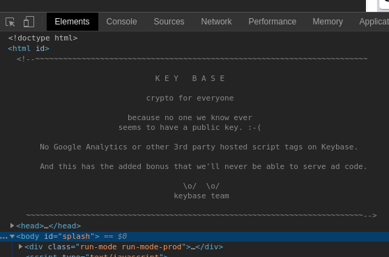

# Gatsby "Hello Dev" Plugin

I originally set out to create a plugin that would replicate the experience you get when opening your dev tools on a site like KeyBase:

However, after trying a few things, it ended up not being possible to get this particular experience using a Gatsby plugin. Hence, this plugin is now an empty shell.

You can do it [with `html.js`](https://www.gatsbyjs.org/docs/custom-html/). See here for more explicit instructions on [adding a top-level HTML comment to your Gatsby site](https://www.chadly.net/gastby-html-comment/).
